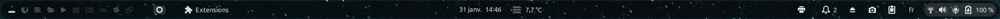
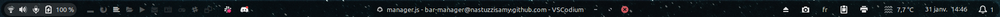

# bar-manager
GNOME bar manager

## Description

This extension allows you to redesign your panel bar however you want.
Hide indicators, move them, reorganize them.

## Example with some extensions installed

Classic GNOME panel bar:

Custom bar with Bar Manager:

